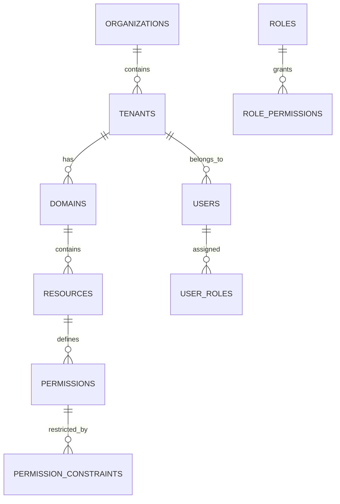

# 🚀 Enterprise User Management System

[](https://spring.io/projects/spring-boot)
[](https://openjdk.java.net/)
[](https://jwt.io/)
[](https://www.postgresql.org/)
[](https://swagger.io/)
[](LICENSE)

> **A production-ready, enterprise-grade user management system built with Spring Boot 3.x, featuring advanced security, multi-tenancy, and comprehensive audit trails.**

## 🌟 **Why This Project Stands Out**

This isn't just another CRUD application. It's a **comprehensive enterprise solution** that demonstrates:
- **Advanced Spring Security** with custom JWT implementation
- **Multi-tenant architecture** with data isolation
- **Fine-grained RBAC** (Role-Based Access Control)
- **Production-ready security patterns**
- **Scalable microservice architecture**
- **Enterprise-level code quality**

---

## 📋 **Table of Contents**

- [🏗️ System Architecture](#️-system-architecture)
- [🔐 Security Features](#-security-features)
- [🎯 Key Features](#-key-features)
- [🛠️ Technology Stack](#️-technology-stack)
- [📊 Database Design](#-database-design)
- [🚀 API Documentation](#-api-documentation)
- [⚡ Performance Features](#-performance-features)
- [🔍 Code Quality](#-code-quality)
- [📈 Scalability](#-scalability)
- [🏃‍♂️ Quick Start](#️-quick-start)

---

## 🏗️ **System Architecture**

### **Multi-Layered Architecture**
```
┌─────────────────────────────────────────────┐
│                 REST Layer                  │
│         (Controllers + OpenAPI)             │
├─────────────────────────────────────────────┤
│              Security Layer                 │
│    (JWT + Custom Annotations + AOP)        │
├─────────────────────────────────────────────┤
│              Service Layer                  │
│         (Business Logic + DTOs)             │
├─────────────────────────────────────────────┤
│               Data Layer                    │
│      (JPA Repositories + Mappers)          │
├─────────────────────────────────────────────┤
│              Database Layer                 │
│        (PostgreSQL + Redis Cache)          │
└─────────────────────────────────────────────┘
```

### **Security Architecture**
```
┌─────────────────┐    ┌─────────────────┐    ┌─────────────────┐
│   JWT Filter    │───▶│  Permission     │───▶│   Data Scope    │
│                 │    │   Validation    │    │   Filtering     │
└─────────────────┘    └─────────────────┘    └─────────────────┘
         │                       │                       │
         ▼                       ▼                       ▼
┌─────────────────┐    ┌─────────────────┐    ┌─────────────────┐
│ Token Blacklist │    │ Custom Aspects  │    │ Tenant Context  │
│    (Redis)      │    │      (AOP)      │    │    Holder       │
└─────────────────┘    └─────────────────┘    └─────────────────┘
```

---

## 🔐 **Security Features**

### **🛡️ Advanced Authentication & Authorization**

#### **Custom JWT Implementation**
- **Dual Token Strategy**: Access + Refresh tokens
- **Token Blacklisting**: Redis-based revocation system
- **Custom Claims**: Role and permission embedding
- **Secure Salt Hashing**: BCrypt with custom salt generation

```java
@RequirePermission(value = {"USER_CREATE", "ADMIN"}, requireAll = true)
public ResponseEntity<UserDto> createUser(@RequestBody UserDto user) {
    // Method protected by custom annotation-based security
}
```

#### **Role-Based Access Control (RBAC)**
- **Hierarchical Permissions**: Granular access control
- **Dynamic Role Assignment**: Runtime permission evaluation
- **Resource-Level Security**: Entity-specific permissions
- **Cached Permissions**: Redis-cached for performance

#### **Multi-Tenant Security**
- **Data Isolation**: Tenant-scoped data access
- **Cross-Tenant Prevention**: Automatic data boundary enforcement

### **🔒 Security Hardening Features**

#### **Rate Limiting**
```java
@Component
public class RateLimitingFilter {
    // Bucket4j implementation with Redis backing
    // 100 requests per minute per IP
}
```

#### **Security Headers**
- **CSP (Content Security Policy)**
- **Permission Policy Headers**
- **CORS Configuration**
- **XSS Protection**

#### **Audit & Monitoring**
- **Security Event Logging**: Failed login attempts, permission violations
- **AOP-Based Auditing**: Automatic audit trail generation
- **IP Tracking**: Client IP logging with proxy support

---

## 🎯 **Key Features**

### **👥 User Management**
- ✅ **Complete CRUD Operations** with validation
- ✅ **User Profile Management** with custom attributes
- ✅ **Account Status Management** (active, disabled, expired)

### **🏢 Multi-Tenant Architecture**
- ✅ **Organization Hierarchy**: Organization → Tenant → User
- ✅ **Domain-Based Segregation**
- ✅ **Tenant-Isolated Resources**

### **🔑 Permission System**
- ✅ **Fine-Grained Permissions**: Resource + Action based
- ✅ **Permission Groups**: Logical grouping for management
- ✅ **Constraint-Based Permissions**: Time, location, resource constraints

### **📊 Advanced Features**
- ✅ **Smart Pagination** with filtering and sorting
- ✅ **Complex Search Queries** with multiple criteria
- ✅ **Soft Delete** with recovery options
- ✅ **Audit Trail** for all operations

---

## 🛠️ **Technology Stack**

### **Backend Framework**
- **Spring Boot 3.2+** - Latest enterprise framework
- **Spring Security 6+** - Advanced security configuration
- **Spring Data JPA** - Database abstraction layer
- **Spring AOP** - Cross-cutting concerns

### **Security & Authentication**
- **JWT (jsonwebtoken)** - Stateless authentication
- **BCrypt** - Password hashing
- **Redis** - Session & cache management
- **Custom Annotations** - Declarative security

### **Database & Caching**
- **PostgreSQL** - Primary database
- **Redis** - Caching & session storage
- **HikariCP** - Connection pooling
- **Liquibase Ready** - Database migrations

### **API & Documentation**
- **OpenAPI 3.0** - API documentation
- **MapStruct** - Type-safe mapping
- **Bean Validation** - Request validation
- **Custom DTOs** - Clean data transfer

### **Monitoring & Quality**
- **SLF4J + Logback** - Structured logging
- **Micrometer** - Metrics collection
- **Custom Exception Handling**
- **Bucket4j** - Rate limiting

---

## 📊 **Database Design**

### **🏗️ Entity Relationship Overview**



### **🔢 Database Statistics**
- **Master Tables**: 8 core entities
- **Reference Tables**: 5 lookup tables  
- **Transaction Tables**: 6 relationship tables
- **Total Relationships**: 15+ foreign key relationships
- **Indexes**: Optimized for query performance
- **Audit Fields**: Automatic timestamp and user tracking

---

## 🚀 **API Documentation**

### **📋 API Overview**
- **REST Endpoints**: 50+ fully documented endpoints
- **OpenAPI 3.0**: Interactive documentation
- **Postman Collection**: Ready-to-use API tests
- **Authentication**: Bearer token required

### **🔗 Key API Categories**

#### **Authentication Endpoints**
```http
POST /auth/login           # User authentication
POST /auth/refresh-token   # Token refresh
POST /auth/logout          # Secure logout
```

#### **User Management**
```http
GET    /users/all          # @RequirePermission("USER_VIEW_ALL")
GET    /users/tbl          # @RequirePermission("USER_VIEW_PAGINATED") 
POST   /users/add          # @RequirePermission("USER_CREATE")
PUT    /users/{id}         # @RequirePermission("USER_UPDATE")
DELETE /users/{id}         # @RequirePermission("USER_DELETE")
```

#### **Master Data Management**
```http
# Organizations, Tenants, Domains, Resources, Permissions, Roles
GET    /{entity}/all       # View all records
GET    /{entity}/tbl       # Paginated view with filtering
POST   /{entity}/add       # Create new record
PUT    /{entity}/{id}      # Update existing
DELETE /{entity}/{id}      # Soft delete
```

---

## ⚡ **Performance Features**

### **🚄 Caching Strategy**
- **Redis Caching**: User permissions, session data
- **Application Cache**: Reference data caching
- **Query Optimization**: Indexed database queries
- **Connection Pooling**: HikariCP for database connections

### **📈 Scalability Features**
- **Stateless Design**: Horizontal scaling ready
- **Database Indexing**: Optimized query performance  
- **Lazy Loading**: JPA lazy loading for associations
- **Pagination**: Memory-efficient data retrieval

---

## 🔍 **Code Quality**

### **🏗️ Architecture Patterns**
- **Clean Architecture**: Separation of concerns
- **Repository Pattern**: Data access abstraction  
- **DTO Pattern**: Clean API contracts
- **Builder Pattern**: Complex object creation

### **🧪 Code Quality Metrics**
- **Custom Annotations**: `@RequirePermission` for declarative security
- **AOP Implementation**: Cross-cutting concerns handling
- **Exception Handling**: Comprehensive error management
- **Input Validation**: Multi-layer validation strategy
- **Type Safety**: MapStruct for mapping, Generic utilities

### **📝 Documentation Quality**
- **Comprehensive JavaDoc**: All public APIs documented
- **Inline Comments**: Complex logic explained
- **README Documentation**: This detailed overview
- **API Documentation**: OpenAPI 3.0 specification

---

## 📈 **Scalability**

### **🌐 Production-Ready Features**
- **Environment Configuration**: Profile-based setup
- **Container Ready**: Docker deployment capable
- **Configuration Management**: Externalized configuration  
- **Logging Strategy**: Structured JSON logging
- **Error Tracking**: Comprehensive exception handling

---

## 🏃‍♂️ **Quick Start**

### **📋 Prerequisites**
```bash
- Java 17+
- Maven 3.6+
- PostgreSQL 13+
- Redis 6+
```

### **⚡ Local Development Setup**

1. **Clone & Setup**
```bash
git clone <repository-url>
cd user-management-system
```

2. **Database Configuration**
```properties
# application-dev.yml
spring:
  datasource:
    url: jdbc:postgresql://localhost:5432/user_management
    username: your_username
    password: your_password
  redis:
    host: localhost
    port: 6379
```

3. **Run Application**
```bash
mvn spring-boot:run -Dspring.profiles.active=dev
```

4. **Access Documentation**
- **Swagger UI**: http://localhost:8080/swagger-ui.html
- **API Docs**: http://localhost:8080/v3/api-docs

---

## 💼 **Professional Highlights**

### **🎯 What This Demonstrates**

#### **Senior-Level Spring Boot Expertise**
- Advanced Spring Security configuration
- Custom authentication providers
- AOP-based cross-cutting concerns
- Production-ready application architecture

#### **Enterprise Security Knowledge**
- JWT implementation with refresh tokens
- Role-based access control (RBAC)
- Multi-tenant data isolation
- Rate limiting and security headers

#### **Database Design Skills**
- Normalized database design
- Query optimization strategies
- Audit trail implementation

#### **API Design Excellence**
- RESTful API principles
- Comprehensive OpenAPI documentation
- Consistent error handling
- Pagination and filtering patterns

#### **Code Quality & Architecture**
- Clean architecture principles
- Design pattern implementation
- Comprehensive error handling
- Type-safe mapping strategies

---

## 📞 **Contact & Collaboration**

This project represents production-ready code that I've architected and implemented, showcasing enterprise-level Spring Boot development skills. I'm actively seeking opportunities to bring this level of expertise to challenging projects.

**This project is part of my professional portfolio. For collaboration, inquiries or Code reviews please reach out directly.**

---

<div align="center">

### 🌟 **grakwana@gmail.com** 🌟

</div>
